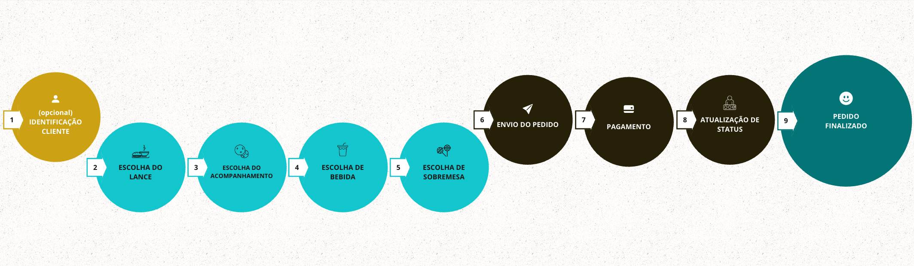
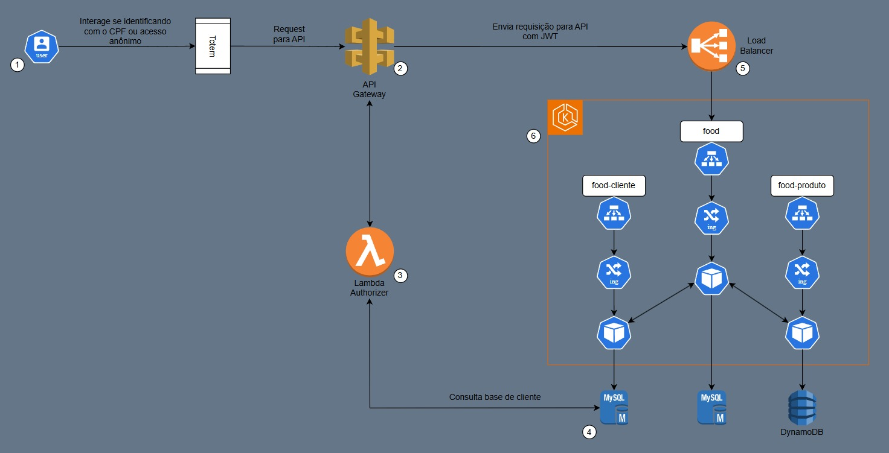

# Aplicação Fast Food - ALFAC ·  

Esta é uma aplicação que tem por objetivo, fornecer uma plataforma de pedidos de fast food. A plataforma permite aos clientes seguir o fluxo comum de um pedido: escolher o lanche com seu complemento, acompanhamento, bebida e sobremesa.

Ao final, o cliente irá realizar o pagamento deste pedido, através de um QR Code e por fim, receber seu pedido.

Para isso, o consumidor desta plataforma deve seguir o fluxo estabelecido na imagem a seguir:

## Fluxo completo no MIRO

### Fase 1

- Brain Storming
- Event Storming
- Fluxo Vertical
- Linguagem Ubíqua

Veja em: [https://miro.com/app/board/uXjVKZNCxxM=/?moveToWidget=3458764595480383068&cot=14](https://miro.com/app/board/uXjVKZNCxxM=/?moveToWidget=3458764595480383068&cot=14)

### Fase 2

- [Desenho da arquitetura](https://miro.com/app/board/uXjVKZNCxxM=/?moveToWidget=3458764595480615411&cot=10)
- [Requisitos da infraestrutura](https://drive.google.com/file/d/1SdsSAvb8gIy9qvau1m_bTNp2WUR5uzds/view?usp=sharing)

Veja em: [https://miro.com/app/board/uXjVKZNCxxM](https://miro.com/app/board/uXjVKZNCxxM=/?share_link_id=127959473892)

### Fase 3

Veja em: [https://miro.com/app/board/uXjVKZNCxxM=/?moveToWidget=3458764600931910148&cot=14](https://miro.com/app/board/uXjVKZNCxxM=/?moveToWidget=3458764600931910148&cot=14)

### Fase 4

Veja em: [https://miro.com/app/board/uXjVKZNCxxM=/?moveToWidget=3458764603014029962&cot=14](https://miro.com/app/board/uXjVKZNCxxM=/?moveToWidget=3458764603014029962&cot=14)

> [!WARNING]  
> **Essa documentação foca na 4° FASE do Tech Challenge - usando Terraform e GitHub Actions. Se precisar, consulte o README.md da 3° FASE no link: https://github.com/ALFAC-Org/food/tree/fase3-devops**

## Tabela de conteúdos

- [Aplicação Fast Food - ALFAC](#aplicação-fast-food---alfac)
  - [Fluxo completo no MIRO](#fluxo-completo-no-miro)
    - [Fase 1](#fase-1)
    - [Fase 2](#fase-2)
    - [Fase 3](#fase-3)
    - [Fase 4](#fase-4)
  - [Tecnologia](#tecnologia)
    - [Na Nuvem](#na-nuvem)
  - [Requisitos](#requisitos)
  - [Arquitetura](#arquitetura)
    - [Visão Geral](#visão-geral)
  - [Fluxo do usuário](#fluxo-do-usuário)
  - [Roadmap](#roadmap)
  - [Entregas](#entregas)
  - [Membros](#membros)

## Tecnologia

- **Linguagem de Programação:** Java 17
- **Framework:** Spring Boot
- **Gerenciador de dependências:** Maven
- **Banco de dados:**
  - Este repositório: MySQL 8
  - Microsserviço `food-cliente`: MySQL 8
  - Microsserviço `food-produto`: AWS DynamoDB
- **Documentação e uso de API's:** Swagger
- **Conteinerização:** Docker
- **Orquestração:** Kubernetes

### Na Nuvem

- **Web Services**:  AWS
- **IaC**: Terraform - v1.9.5

## Requisitos

- Docker _(versão 27.0.3)_ - para rodar localmente
- Kubernetes _(versão 1.30)_ - para rodar localmente e na nuvem (AWS)
- Terraform _(versão 1.9.5)_ - para rodar na nuvem (AWS) e GitHub Actions

## Arquitetura

### Visão Geral

A aplicação está estruturada no padrão de _Clean Architecture_. 

Pode ser executada tanto via _Docker_, _Kubernetes_ e _Terraform_. 

Podendo ser hospedada tanto localmente ou na nuvem, usando serviços como _AWS_. 

A interação da aplicação se dá através de _APIs_ com o _Swagger_ disponibilizado.

### Diagrama

## Tutoriais

| Passo                                                                                                                                    | Vídeo                                                                                                                                                                                                                                 |
|------------------------------------------------------------------------------------------------------------------------------------------|---------------------------------------------------------------------------------------------------------------------------------------------------------------------------------------------------------------------------------------|
| 0. Introdução geral                                                                                                                      | [00-INTRODUCAO_GERAL](https://drive.google.com/file/d/13cn5Z7FZzmkuh7Qo-Y28Z0EYblrOIwRw/view?usp=sharing)                                                                                                                             |
| 1. Introdução aos repositórios                                                                                                           | [01-INTRODUCAO_AOS_REPOSITORIOS](https://drive.google.com/file/d/1YMbt2wP6e9ZTgohPGcBUdwVdxEM2eARD/view?usp=sharing)                                                                                                                  |
| 2. Configuração das variáveis ambiente                                                                                                   | [02-CONFIGURACAO_VARIAVEIS_AMBIENTE](https://drive.google.com/file/d/1pnvF8psjq648Hrk1QU6T_vryq6WkDpC3/view?usp=sharing)                                                                                                              |
| 3. Provisão da infraestrutura com [https://github.com/ALFAC-Org/food-cloud-infra](https://github.com/ALFAC-Org/food-cloud-infra)         | [03-PROVISAO_INFRA_P1](https://drive.google.com/file/d/1RO3DKyr7qyglsGnLnfbETU2rNS2WrM2k/view?usp=sharing) / [03-PROVISAO_INFRA_P2](https://drive.google.com/file/d/1dxIx_XCkQ9s_It_JyRBPpilf5wwh6SEe/view?usp=sharing)               |
| 4. Provisão dos bancos de dados com [https://github.com/ALFAC-Org/food-database](https://github.com/ALFAC-Org/food-database)             | [04-PROVISAO_DB_P1](https://drive.google.com/file/d/1xSe8PQLalyHxy3Pn8XOu3g5v9cOUS4jN/view?usp=sharing) / [04-PROVISAO_DB_P2](https://drive.google.com/file/d/1V_NOCmLwTr8kaZIh56gciOPsf_hsCWUP/view?usp=sharing)                     |
| 5. Provisão das lambdas com [https://github.com/ALFAC-Org/food-serveless-function](https://github.com/ALFAC-Org/food-serveless-function) | [05-PROVISAO_LAMBDAS_P1](https://drive.google.com/file/d/1823lFmz1yaIKIr5s9D8B5prlJcAu4rL0/view?usp=sharing) / [05-PROVISAO_LAMBDAS_P1](https://drive.google.com/file/d/1Nd89oZSWY7JiHjz1RMSN33OU87G0C0pG/view?usp=sharing)           |
| 6. Provisão da aplicação food-produto [https://github.com/ALFAC-Org/food-produto](https://github.com/ALFAC-Org/food-produto)             | [06-PROVISAO_FOOD_PRODUTO_P1](https://drive.google.com/file/d/1_wtyYeHCGJmqkt6kaxhDAm4K21J2apxS/view?usp=sharing) / [06-PROVISAO_FOOD_PRODUTO_P2](https://drive.google.com/file/d/1oFmnhd6c6t9OG7-YzLDs6Ua65qedv3O6/view?usp=sharing) |
| 7. Provisão da aplicação food-cliente [https://github.com/ALFAC-Org/food-cliente](https://github.com/ALFAC-Org/food-cliente)             | [07-PROVISAO_FOOD_CLIENTE_P1](https://drive.google.com/file/d/1x_k4ce2Rexn3E5dnmQJrnhFS6orTdNOK/view?usp=sharing) / [07-PROVISAO_FOOD_CLIENTE_P2](https://drive.google.com/file/d/1WA3WTTX3FD6f-mM6UiV3gLq7IqI7Pik3/view?usp=sharing) |
| 8. Provisão da aplicação principal com [https://github.com/ALFAC-Org/food](https://github.com/ALFAC-Org/food)                            | [08-PROVISIONA_FOOD_P1](https://drive.google.com/file/d/18fwyjMtbWwi4nOUinI-7_72hkPy1YxS8/view?usp=sharing) / [08-PROVISIONA_FOOD_P2](https://drive.google.com/file/d/14Pw2Z9QN9hvKGe40A8mh5OwhgnYl2HwX/view?usp=sharing)             |
| 9. Simulando cliente na plataforma: Load Balancer e API Gateway                                                                          | [09-01_FLUXO_LOAD_BALANCER](https://drive.google.com/file/d/1kUniYudGX6BF6-E_fMayjjyV_pWH1rKr/view?usp=sharing) / [09-02_FLUXO_API_GATEWAY](https://drive.google.com/file/d/1SDrMZ_a94kCGd-VggUDn7TmByYVf3MtU/view?usp=sharing)       |

Todos os vídeos estão disponíveis também aqui: [https://drive.google.com/drive/folders/1C9UbKeiVNRIM7CSv-HMgMHZflwbqI5tQ?usp=sharing](https://drive.google.com/drive/folders/1C9UbKeiVNRIM7CSv-HMgMHZflwbqI5tQ?usp=sharing)

## Fluxo do usuário

Como fazer um pedido em nossa plataforma?

Veja em [Fluxo do usuário](./docs/FLUXO_USUARIO.md).

## Roadmap

  
FASE 1

Veja em [https://github.com/ALFAC-Org/food/tree/hexagonal#roadmap](https://github.com/ALFAC-Org/food/tree/hexagonal#roadmap)

  
FASE 2

Veja em [https://github.com/ALFAC-Org/food/tree/fase2-clean-arch?tab=readme-ov-file#roadmap](https://github.com/ALFAC-Org/food/tree/fase2-clean-arch?tab=readme-ov-file#roadmap)

  
FASE 3

Veja em [https://github.com/ALFAC-Org/food/tree/fase3-devops?tab=readme-ov-file#roadmap](https://github.com/ALFAC-Org/food/tree/fase3-devops?tab=readme-ov-file#roadmap)

  
FASE 4

1. Refatore o projeto, separe-o em ao menos 3 (três) microsserviços. Alguns
   exemplos de serviços:
   - [x] a. Pedido: responsável por operacionalizar o processo de pedidos,
   registrando os pedidos, retornando as informações necessárias
   para montar um pedido, listando os pedidos registrados e em
   processo de produção (visão de cliente).
   - [x] b. Pagamento: responsável por operacionalizar a cobrança de um
   pedido, registrando a solicitação de pagamento, recebendo o
   retorno do processador de pagamento e atualizando o status do
   pedido.
   - [x] c. Produção: responsável por operacionalizar o processo de
   produção do pedido, acompanhando a fila de pedidos (visão da
   cozinha), atualização de status de cada passo do pedido.

Ao refatorar, os microsserviços devem conter testes unitários.
- [x] a. Ao menos um dos caminhos de teste deve implementar BDD.
- [x] b. Em todos os projetos, a cobertura de teste deve ser de 80%.

2. Seus repositórios devem ser separados para cada aplicação e devem respeitar as seguintes regras:
- [ ] a. As branchs main/master devem ser protegidas, não permitindo commits
 diretamente.
- [x] b. Pull Request para branch main/master, que deve validar o build da aplicação, e a qualidade de código via sonarqube ou qualquer outro
 serviço semelhante, cobrindo 80% de coverage no mínimo.
- [x] c. No Merge, o deploy de todos seus microsserviços devem ser executados, isso significa que todos os repositórios devem estar com CI/CD criados, e executados corretamente.

## Entregas

- FASE 1 - **28/05/2024** - **FEITO**
- FASE 2 - **30/07/2024** - **FEITO**
- FASE 3 - **01/10/2024** - **FEITO**
- FASE 4 - **03/12/2024** - **AGUARDANDO**

## Membros

| Nome | RM | E-mail | GitHub |
| --- | --- | --- | --- |
| Leonardo Fraga | RM354771 | [rm354771@fiap.com.br](mailto:rm354771@fiap.com.br) | [@LeonardoFraga](https://github.com/LeonardoFraga) |
| Carlos Henrique Carvalho de Santana | RM355339 | [rm355339@fiap.com.br](mailto:rm355339@fiap.com.br) | [@carlohcs](https://github.com/carlohcs) |
| Leonardo Alves Campos | RM355568 | [rm355568@fiap.com.br](mailto:rm355568@fiap.com.br) | [@lcalves](https://github.com/lcalves) |
| Andre Musolino | RM355582 | [rm355582@fiap.com.br](mailto:rm355582@fiap.com.br) | [@amusolino](https://github.com/amusolino) |
| Caio Antunes Gonçalves | RM354913 | [rm354913@fiap.com.br](mailto:rm354913@fiap.com.br) | [@caio367](https://github.com/caio367) |
